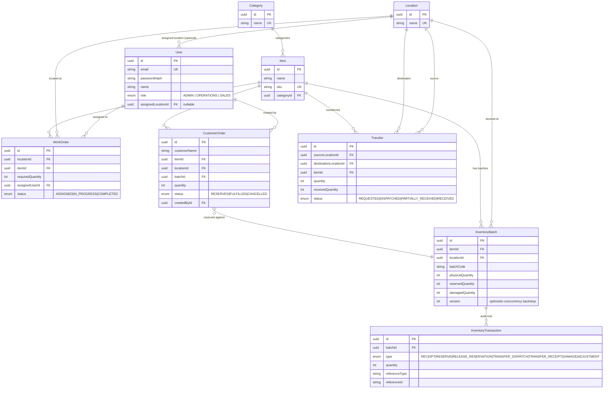

# Database Schema / ER Diagram

## Why `availableQuantity` isn't a column

`InventoryBatch` only persists `physicalQuantity`, `reservedQuantity`, and
`damagedQuantity`. `availableQuantity = physical - reserved - damaged` is
computed at read time (`deriveAvailable()` in `inventory.service.ts`) instead
of stored and kept in sync. A derived value can never drift out of sync with
its inputs — there's no update path that can forget to also update it.

## Why `InventoryTransaction` exists

It's an append-only ledger of every quantity change, each tagged with the
business event that caused it (`referenceType` + `referenceId`, e.g.
`TRANSFER` + the transfer's id). Two things fall out of this for free:

1. **Auditability** — you can reconstruct any batch's history.
2. **Structural duplicate-prevention** — `(referenceId, type, referenceType)`
   has a unique constraint, so the same transfer dispatch, or the same
   receipt call, cannot be posted twice even if the application-level status
   check is bypassed or racing.
